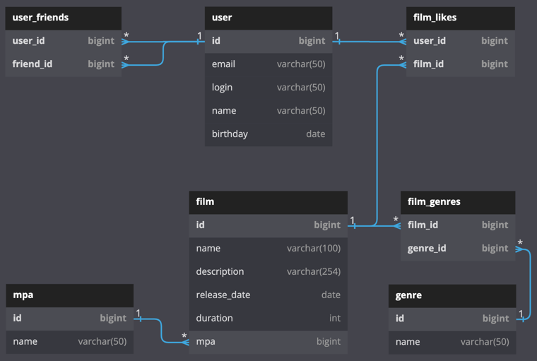

## Яндекс Практикум: проект "FilmoRate"

Кинопоиск для своих. Мини социальная сеть, которая поможет выбрать кино на основе того, какие фильмы вы и ваши друзья смотрите и какие оценки им ставите.

## Стек

* Java 11
* Spring Boot 2.7.0
* H2 2.1
* Maven
* Lombok
* JUnit
* RESTful API

## API

После запуска приложения Swagger документация будет доступна по адресу `http://localhost:8080/swagger-ui/index.html`

## Data base diagram



## Описание таблиц

user - информация о пользователях системы. Primary key - id

user_friends - информация о друзьях пользователя. Primary key - user_id + friend_id

user_friendships - информация о заявках пользователя в друзья. agree - подтверждена ли заявка. Primary key - source_id + destination_id

film - информация о фильмах: название, описание, дата релиза и прочие. Primary key - id

film_likes - информация о лайках пользователей соответствующих фильмов. Primary key - user_id + film_id

film_genres - информация о жанрах фильма. genre_id - foreign key на таблицу genre. Primary key - film_id + genre_id

genre - справочник жанров. Primary key - id

mpa - рейтинг Ассоциации кинокомпаний. Primary key - id

## Примеры запросов

##### Друзья пользователя

```SQL
SELECT
    fr.id,
    fr.name,
    fr.login
FROM user AS u
INNER JOIN user_friends AS uf ON u.id = uf.user_id
INNER JOIN user AS fr ON uf.freind_id = fr.id
WHERE
    u.id = 1
```

##### Неподтвержденные заявки в друзья пользователя

```SQL
SELECT
    fr.id,
    fr.name,
    fr.login,
    uf.agree
FROM user AS u
INNER JOIN user_friendships AS uf ON u.id = uf.source_id
INNER JOIN user AS fr ON uf.destination_id = fr.id
WHERE
    u.id = 1
    AND uf.agree = false
```

##### Понравившиеся фильмы пользователя

```SQL
SELECT
    f.id,
    f.name,
    f.description
FROM user AS u
INNER JOIN film_likes AS fl ON u.id = fl.user_id
INNER JOIN film AS f ON fl.film_id = f.id
WHERE
    u.id = 1
```

##### Рейтинг mpa фильма

```SQL
SELECT
    f.id,
    f.name,
    f.description,
    mpa.name
FROM film AS f
LEFT JOIN mpa ON f.mpa = mpa.id
WHERE
    f.id = 1
```

##### Жанры фильма

```SQL
SELECT
    g.id,
    g.name
FROM film AS f
INNER JOIN film_genres AS fg ON f.id = fg.film_id
INNER JOIN genre AS g ON fg.genre_id = g.id
WHERE
    f.id = 1
```
